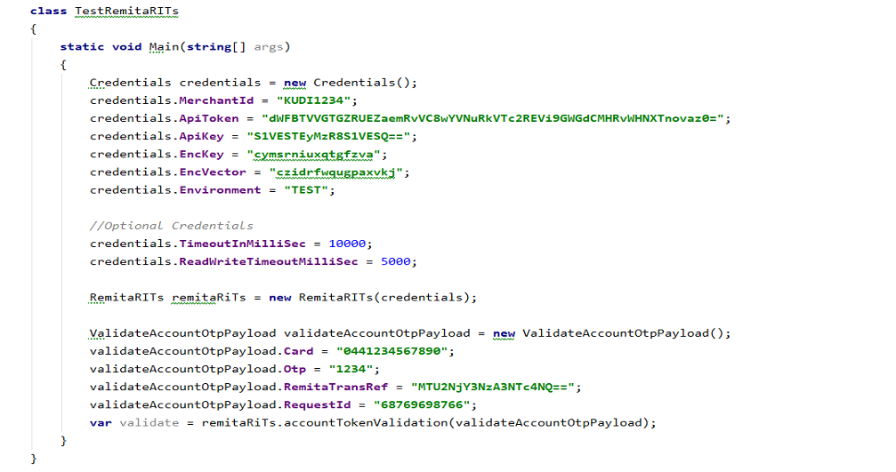

# Remita Interbank Transfer Service (RITs) .NET SDK
.NET SDK for Remita Interbank Transfer Service.

## Prerequisites
The workflow to getting started on RITs is as follows:

*  Register a profile on Remita: You can visit [Remita](https://login.remita.net) to sign-up if you are not already registered as a merchant/biller on the platform.
*  Receive the Remita credentials that certify you as a Biller: Remita will send you your merchant ID and an API Key necessary to secure your handshake to the Remita platform.
## Requirements
*  Microsoft Visual Studio 
* .NET 2.0 or later

## Demo Console C# App
Clone/Download the Demo C# console application that showcases the available methods in Remita Interbank Transfer service here: [Clone Demo App and Install SDK (Nuget)](https://github.com/RemitaNet/rits-sdk-dotnet-demo)


## Configuration
All merchant credentials needed to use RITs are being setup by instantiating the Credential Class and set the properties 
in this class accordingly. Properties such as MerchantId, ApiKey, ApiToken, Key, Iv and the Environment needs to be set.
 
_Note:_ Environment can either be TEST or LIVE, each of this environment has it respective Credential. Ensure you set the 
right credentials. By default Environment is TEST


## Methods
#### Adding Account(s) To Your Profile
Adding an account to your merchant profile on the RITs is a dual process. 


* The first step is to AddAccount, Fields required to add account includes the following;
	1. accountNo: This is the number of the bank account being linked to merchant profile
	2. bankCode: This is the CBN code of the bank in which the account is domiciled
	3. transRef: This uniquely identifies the transaction
	4. requestId: This uniquely identifies the request
	


* The second step validates the account holder via bank authentication on the account details. You will be required by 	your bank to validate the account details the AddAccount request is being issued for, required fields(Payloads) are as follow;
	1. card: This is the one of the authentication detail required by the bank from the account owner to validate 	AddAccount request
	2. otp: This is the another authentication detail required by the bank from the account owner to validate AddAccount 	request
	3. remitaTransref: This uniquely identifies the specific add account request the validation is being called for
	4. requestId: This uniquely identifies the request
	



Successful authentication through the bank links the designated account to the corresponding merchant profile on the
RITs platform.

#### Payments
Payments on the RITs platform can only be made from Remita-identifiable accounts. This means that before an account
can be debited on the RITs, it must be linked to a profile. Merchants may process payments via the following SDK
methods on the platform:

* Single Payment Request: This charges/debits a merchant’s account with a specified amount to credit a designated 	beneficiary account. Fields(payload) to set include:
	1. fromBank: This is the CBN code of the funding bank
	2. debitAccount: This is the funding account number
	3. toBank: The CBN code of destination bank where account number to be credited is domiciled. (You can use the Banks Enquiry method to get the list of all supported Banks’ code).
	4. creditAccount: This is the account number to be credited in destination bank.
	5. narration: The narration of the payment. This will typically be visible both in the debit and credit account statement. Max length 30 characters
	6. amount: The amount to be debited from the debitAccountToken and credited to creditAccount in bank toBank. Format - ##.##
	7. beneficiaryEmail: Email of the beneficiary (email of creditAccount holder)
	8. transRef: A unique reference that identifies a payment request. This reference can be used sub- sequently to retrieve the details/status of the payment request
	9. requestId: This uniquely identifies the request


* Bulk Send Payment Request: Here, a single amount is debited to credit multiple accounts across several banks. Fields(payload) to set include the bulkPaymentInfo Parameters and paymentDetails Parameters
	
	bulkPaymentInfo Payload
	1. batchRef: A unique reference that identifies a bulk payment request.
	2. debitAccount: Funding account number
	3. bankCode: 3 digit code representing funding bank
	4. creditAccount: This is the account number to be credited in destination bank.
	5. narration: Description of the payment
	6. requestId: This uniquely identifies the request


	paymentDetails Payload
	1. beneficiaryBankCode: The CBN code of destination bank where account number to be credited is domiciled. (You can use the Banks Enquiry method to get the list of all supported Banks’ code)
	2. beneficiaryAccountNumber: This is the account number to be credited in destination bank.
	3. narration: The narration of the payment. This will typically be visible both in the debit and credit account statement. Max length 30 characters
	4. amount: The amount to be debited from the debitAccountToken and credited to creditAccount in bank toBank
	5. beneficiaryEmail: Email of the beneficiary
	6. transRef: A unique reference that identifies a payment request. This reference can be used sub- sequently to retrieve the details/status of the payment request


#### Payment Request Status
The payment request status method essentially retrieves the status of a previous payment request(Single payment and Bulk payment) using its transaction reference.

* Single Payment Request Status:
	1. transRef: This should be the same transRef that was used for the single payment request
	2. requestId: This uniquely identifies the request


* Bulk Send Payment Request Status: 
	1. batchRef: This should be the same batchRef that was used for the bulk payment request
	2. requestId: This uniquely identifies the request


#### Account Enquiry
Payment Request Status finds all available information on a specific account, required fields(Payloads) are as follow;
	1. accountNo: Account number of tokenized account to be looked up
	2. bankCode: The bank code where the account is domiciled. Use the Banks Enquiry method
	3. requestId: This uniquely identifies the request


#### Bank Enquiry
This method lists the banks that are active on the RITs platform. required fields(Payloads) are as follow;
	1. requestId: This uniquely identifies the request


## Exceptions

```
Unhandled Exception: System.NullReferenceException: Object reference not set to an instance of an object.
```

This might occur when trying to access an empty field from remitaRITs. You can use the status' response or 
(responseCode or responseDescription) in data to ensure you have a valid response from remitaRITs. However,
it is advisable you catch this exception.

```
Unhandled Exception: System.IO.FileNotFoundException: Could not load file or assembly 'RestSharp...
```

This might occur when 'RestSharp' is not referenced in your project. Simply add RestSharp reference.

```
Unhandled Exception: System.IO.FileNotFoundException: Could not load file or assembly 'Nancy, Version=2.0.0.0...
```

This might occur when 'Nancy' is not referenced in your project. Simply add Nancy reference.

---
    
## Support
- For all other support needs, support@remita.net
